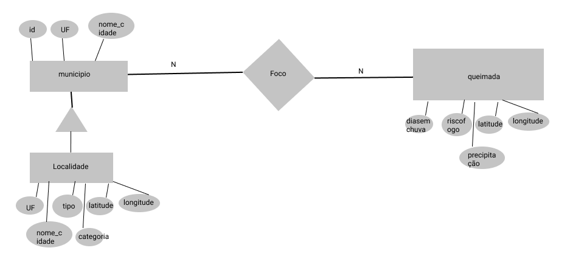
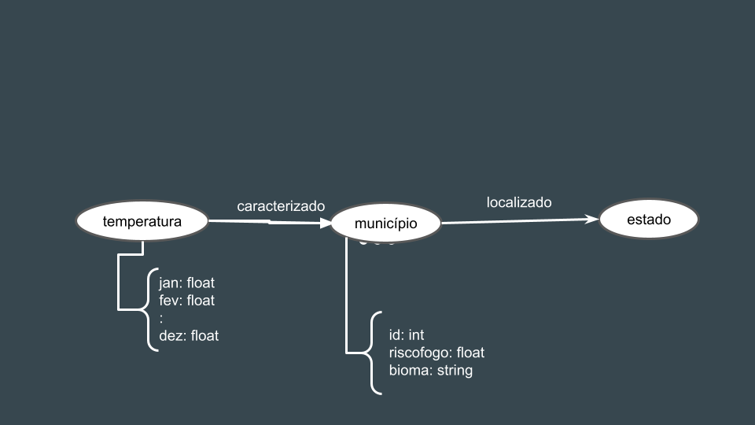

# Apresentação da Final

# Estrutura de Arquivos e Pastas

A estrutura aqui apresentada é uma simplificação daquela proposta pelo [Cookiecutter Data Science](https://drivendata.github.io/cookiecutter-data-science/). Também será aceito que o projeto adote a estrutura completa do Cookiecutter Data Science e isso será considerado um diferencial. A estrutura geral é a seguinte e será detalhada a seguir:

~~~
├── README.md  <- arquivo apresentando a proposta
│
├── data
│   ├── external       <- dados de terceiros em formato usado para entrada na transformação
│   ├── interim        <- dados intermediários, e.g., resultado de transformação
│   ├── processed      <- dados finais usados para a publicação
│   └── raw            <- dados originais sem modificações
│
├── notebooks          <- Jupyter notebooks ou equivalentes
│
├── slides             <- arquivo de slides em formato PDF
│
├── src                <- fonte em linguagem de programação ou sistema (e.g., Orange, Cytoscape)
│   └── README.md      <- instruções básicas de instalação/execução
│
└── assets             <- mídias usadas no projeto
~~~

Na raiz deve haver um arquivo de nome `README.md` contendo a apresentação do projeto, como detalhado na seção seguinte.

## `data`

Arquivos de dados usados no projeto, quando isso ocorrer.

## `notebooks`

Testes ou prototipos relacionados ao projeto que tenham sido executados no Jupyter.

## `src`

Projeto na linguagem escolhida caso não seja usado o notebook, incluindo todos os arquivos de dados e bibliotecas necessários para a sua execução. Só coloque código Pyhton ou Java aqui se ele não rodar dentro do notebook.

 Acrescente na raiz um arquivo `README.md` com as instruções básicas de instalação e execução.

## `assets`

Qualquer mídia usada no seu projeto: vídeo, imagens, animações, slides etc. Coloque os arquivos aqui (mesmo que você mantenha uma cópia no diretório do código).

# Apresentação da Entrega Final do Projeto

# Projeto `Analise de queimadas no Brasil`

# Equipe `Os Brabos de Banco de Dados` - `OBBD`
* `Victor Agozzini Scholze` - `206457`
* `Thiago Henrique Da Costa` - `206234`

## Resumo do Projeto
> Pegada de carbono e conservação do meio ambiente, são temas que ganharam extrema importância nos últimos anos. No Brasil, segundo o ClimaInfo, se incluíssemos as queimadas na floresta amazônica na pegada de carbono, a emissão praticamente dobraria. Como consequência das queimadas, ocorre também o desmatamento, o qual gera impactos ambientais, econômicos e sociais em grande parte do país, uma vez que há uma dependência ambiental deste enorme bioma. Com isso em mente, quisemos analisar mais afundo as queimadas em nosso país, criando um dataset onde podemos armazenar informações de diferentes fontes e analisá-las, a fim de compreender melhor esse problema, que há anos vem se tornando cada vez mais evidente.

## Slides da Apresentação
> [PDF de apresentação](slides/slidesprojeto.pdf)

## Modelo Conceitual

> 

## Modelos Lógicos

> Modelo relacional
~~~

FOCO (_datahora_, _id_, bioma, diasemchuva, precipitacao, riscofogo, latitude, longitude)
  id chave estrangeira -> municipio(id)
MUNICIPIO (_id_, UF, nome, latitude, longitude)
FOCOBIOMA(_campo_,valor,porcentagem do total)
FOCOESTADO(_campo_,valor,porcentagem do total)

~~~

> Modelo de grafos de propriedades
>
> 

## Dataset Publicado

título do arquivo/base | link | breve descrição
----- | ----- | -----
`Focos2020` | [link](data/processed/Focos2020.csv) | `Contém dados dos focos, como localização, dias sem chuva, precipitação, risco de fogo`
`FocosBioma2020_ajustado` | [link](data/processed/FocosBioma2020_ajustado.csv) | `Biomas e o número de queimadas em cada um`
`FocosEstado2020_ajustado` | [link](data/processed/FocosEstado2020_ajustado.csv) | `Queimadas ordenadas por estados`
`Localidades.xlsx` | [link](data/processed/Localidades.xlsx) | `Caracteristicas dos municípios, como tipo, categoria, posição geográfica`

## Bases de Dados
> Elencar as bases de dados fonte utilizadas no projeto.

título da base | link | breve descrição
----- | ----- | -----
`Localidades brasileira` | [link](https://geoftp.ibge.gov.br/organizacao_do_territorio/estrutura_territorial/localidades/Shapefile_SHP/) | `Características de cada municipio do País`
`Temperatura média Manaus` | [link](https://www.kaggle.com/volpatto/temperature-timeseries-for-some-brazilian-cities) | `Timeseries da temperatura média mensal de Manaus`
`Focos 2020` | [link](https://queimadas.dgi.inpe.br/queimadas/bdqueimadas#tabela-de-atributos) | `Dados de satélite, informando risco de fogo, dias sem chuva`
`Queimadas gráfico` | [link](https://queimadas.dgi.inpe.br/queimadas/bdqueimadas#graficos) | `Quantidades de queimadas por estado, semana e bioma`

## Detalhamento do Projeto
> Apresente aqui detalhes do processo de construção do dataset e análise. Nesta seção ou na seção de Perguntas podem aparecer destaques de código como indicado a seguir. Note que foi usada uma técnica de highlight de código, que envolve colocar o nome da linguagem na abertura de um trecho com `~~~`, tal como `~~~python`.
> Os destaques de código devem ser trechos pequenos de poucas linhas, que estejam diretamente ligados a alguma explicação. Não utilize trechos extensos de código. Se algum código funcionar online (tal como um Jupyter Notebook), aqui pode haver links. No caso do Jupyter, preferencialmente para o Binder abrindo diretamente o notebook em questão.

~~~python
df = pd.read_excel("/content/drive/My Drive/Colab Notebooks/dataset.xlsx");
sns.set(color_codes=True);
sns.distplot(df.Hemoglobin);
plt.show();
~~~

> Se usar Orange para alguma análise, você pode apresentar uma captura do workflow, como o exemplo a seguir e descrevê-lo:

> Coloque um link para o arquivo do notebook, programas ou workflows que executam as operações que você apresentar.

> Aqui devem ser apresentadas as operações de construção do dataset:
* extração de dados de fontes não estruturadas como, por exemplo, páginas Web
* agregação de dados fragmentados obtidos a partir de API
* integração de dados de múltiplas fontes
* tratamento de dados
* transformação de dados para facilitar análise e pesquisa

> Se for notebook, ele estará dentro da pasta `notebook`. Se por alguma razão o código não for executável no Jupyter, coloque na pasta `src` (por exemplo, arquivos do Orange ou Cytoscape). Se as operações envolverem queries executadas atraves de uma interface de um SGBD não executável no Jupyter, como o Cypher, apresente na forma de markdown.

## Evolução do Projeto
> Relatório de evolução, descrevendo as evoluções na modelagem do projeto, dificuldades enfrentadas, mudanças de rumo, melhorias e lições aprendidas. Referências aos diagramas, modelos e recortes de mudanças são bem-vindos.
> Podem ser apresentados destaques na evolução dos modelos conceitual e lógico. O modelo inicial e intermediários (quando relevantes) e explicação de refinamentos, mudanças ou evolução do projeto que fundamentaram as decisões.
> Relatar o processo para se alcançar os resultados é tão importante quanto os resultados.

## Perguntas de Pesquisa/Análise Combinadas e Respectivas Análises

> Apresente os resultados da forma mais rica possível, com gráficos e tabelas. Mesmo que o seu código rode online em um notebook, copie para esta parte a figura estática. A referência a código e links para execução online pode ser feita aqui ou na seção de detalhamento do projeto (o que for mais pertinente).

> Liste aqui as perguntas de pesquisa/análise e respectivas análises. Nem todas as perguntas precisam de queries que as implementam. É possível haver perguntas em que a solução é apenas descrita para demonstrar o potencial da base. Abaixo são ilustradas três perguntas, mas pode ser um número maior a critério da equipe.
>
### Perguntas/Análise com Resposta Implementada

> As respostas às perguntas podem devem ser ilustradas da forma mais rica possível com tabelas resultantes, grafos ou gráficos que apresentam os resultados. Os resultados podem ser analisados e comentados. Veja um exemplo de figura ilustrando uma comunidade detectada no Cytoscape:

> 

#### Pergunta/Análise 1
> * O estado com mais foco é o com maior risco fogo?
>   
>   * Explicação sucinta da análise que será feita e conjunto de queries que
>     responde à pergunta.

#### Pergunta/Análise 2
> * Na amazônia, durante meses mais quentes, ocorrem mais queimadas? 
>   
>   * Explicação sucinta da análise que será feita e conjunto de queries que
>     responde à pergunta.

#### Pergunta/Análise 3
> * Existe relação de risco fogo com dias sem chuvas nos biomas?
>   
>   * Explicação sucinta da análise que será feita e conjunto de queries que
>     responde à pergunta.

### Perguntas/Análise Propostas mas Não Implementadas

#### Pergunta/Análise 1
> * Risco fogo é maior em regiões urbanas ou rurais?
>   
>   * Com o arquivo de localidades, é possivel caracterizar uma região como urbana, rural, povoado, reserva. Assim na tabela de focos obtemos o risoc de fogo de cada municipio em um determinado periodo e as características dele, ajudando a compreender se existe relação entre o tipo de ocupação e a ocorrência de focos.

#### Pergunta/Análise 2
> * Biomas com maiores risco fogo
>   
>   * Determinamos um risco fogo mínimo e filtramos para os dados com indices acima dele, vendo esta informação com o id da cidade, podemos contar qual bioma é o mais recorrente. Isso ajuda a entender se um bioma mais úmido está na frente de um mais seco, indicando que há algo erado com aquele local, o qual deve estar ocorrendo muita intterferencia humana ou uma mudança acentuada do clima.

> Coloque um link para o arquivo do notebook que executa o conjunto de queries. Ele estará dentro da pasta `notebook`. Se por alguma razão o código não for executável no Jupyter, coloque na pasta `src`. Se as queries forem executadas atraves de uma interface de um SGBD não executável no Jupyter, como o Cypher, apresente na forma de markdown.
